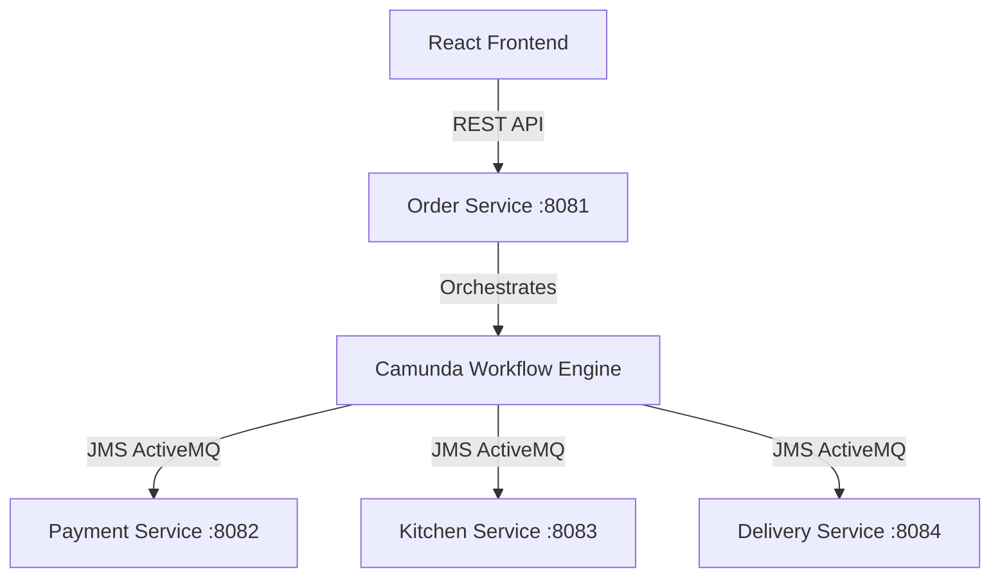

# 🍔 FoodHub: Premium Order-to-Delivery System (Saga Orchestration)

FoodHub is a state-of-the-art, asynchronous food ordering and delivery web application built with **Spring Boot Microservices**, **Camunda BPMN Saga Orchestration**, **ActiveMQ**, and a beautiful **Glassmorphic React Frontend**.

The system utilizes the **Saga Pattern** to manage distributed transactions across four microservices with automatic compensations (refunds, ticket rollbacks) in case of system failures.

---

## 🏗️ System Architecture & Services

The system is decomposed into four Spring Boot microservices communicating asynchronously via **Apache ActiveMQ** queues:



### 1. 📋 Order Service (`order-service` - Port 8081)
- Exposes REST APIs for customer registration, placing orders, processing payments, and tracking status.
- Integrates the **Camunda 7 Workflow Engine** to orchestrate the order-to-delivery lifecycle.
- Hosts the embedded **ActiveMQ Broker** for JMS queue communication.

### 2. 💳 Payment Service (`payment-service` - Port 8082)
- Asynchronously processes payment authorizations via `payment-request-queue`.
- Handles credit cards, UPI, and cash-on-delivery (COD) flows.
- Fires success/failure messages back to `payment-response-queue`.
- Supports automated refund compensation flows.

### 3. 🍳 Kitchen Service (`kitchen-service` - Port 8083)
- Listens for food preparation tickets from the workflow engine.
- Manages kitchen status transitions (`RECEIVED` ➔ `PREPARING` ➔ `READY_FOR_DELIVERY`).
- Integrates with the Shop Keeper dashboard for manual acceptance and preparation controls.

### 4. 🚀 Delivery Service (`delivery-service` - Port 8084)
- Coordinates rider assignment and tracking.
- Updates delivery status (`ASSIGNED` ➔ `OUT_FOR_DELIVERY` ➔ `DELIVERED`).
- Integrates with the Delivery Partner dashboard for rider execution.

---

## 🎨 Premium Frontend Features
The frontend is a dark-themed, glassmorphic single-page application built on **Vite + React**:
- **Customer View**: Search local kitchens globally by specialties, categories, or dishes. Supports live order status tracking and interactive checkout.
- **Shop Keeper View**: Manage order tickets, accept new orders, and update preparation status.
- **Delivery Partner View**: Accept delivery assignments, view customer details, and confirm cash collection on delivery.

---

## ⚙️ How to Run Locally

### Prerequisites
- Java 17 or higher
- Maven 3.8+
- Node.js (v18+)

### 1. Start all Backend Microservices
Run the batch file in the root directory to build and boot all 4 services and the ActiveMQ broker:
```bash
.\run-all.bat
```

### 2. Start the Frontend Server
Navigate to the frontend directory, install dependencies, and run the Vite dev server:
```bash
cd frontend
npm install
npm run dev
```
Open **`http://localhost:5173/`** in your browser.

---

## 🛠️ Git & Push Operations

To commit and push future changes to your GitHub repository:
```bash
git add .
git commit -m "Commit message"
git push
```
