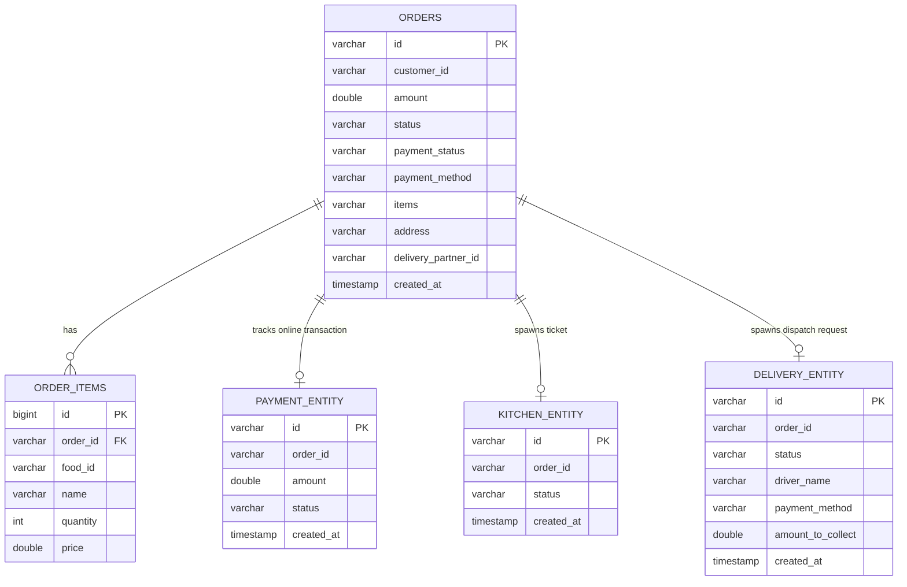

# Deliverable 2: Database Design

This document details the database schema, table structures, and relationships designed and implemented for the **Online Food Order Processing System**.

---

## 1. Relational Database Tables

The microservices utilize in-memory JPA-managed entities mapping to relational tables:

### A. Table: `orders` (`order-service`)
Stores primary order status details and items ordered.

| Column Name | Data Type | Key / Constraint | Description |
| :--- | :--- | :--- | :--- |
| `id` | `VARCHAR(255)` | **PRIMARY KEY** | Unique order transaction ID (UUID format). |
| `customer_id` | `VARCHAR(255)` | NOT NULL | Username or ID of customer placing the order. |
| `amount` | `DOUBLE` | NOT NULL | Total billing price of the order in INR. |
| `status` | `VARCHAR(50)` | NOT NULL | Lifecycle: `PLACED`, `PAYMENT_COMPLETED`, `PREPARING`, `READY_FOR_DELIVERY`, `OUT_FOR_DELIVERY`, `DELIVERED`, `CANCELLED`, `FAILED`. |
| `payment_status`| `VARCHAR(50)` | NOT NULL | State: `PENDING`, `PAID`, `COD_PENDING`, `REFUNDED`. |
| `payment_method`| `VARCHAR(50)` | NULL | Method: `CARD`, `UPI`, `COD`. |
| `items` | `VARCHAR(1000)`| NOT NULL | Human-readable string summary of food items. |
| `address` | `VARCHAR(1000)`| NOT NULL | Full address details concatenated with contact phone number. |
| `delivery_partner_id` | `VARCHAR(255)` | NULL | Assigned rider username. |
| `created_at` | `TIMESTAMP` | NOT NULL | Order creation timestamp. |

### B. Table: `order_items` (`order-service`)
Handles itemized breakdown of foods ordered. Contains a foreign key relation to the `orders` table.

| Column Name | Data Type | Key / Constraint | Description |
| :--- | :--- | :--- | :--- |
| `id` | `BIGINT` | **PRIMARY KEY (AUTO_INCREMENT)** | Unique item sequence ID. |
| `order_id` | `VARCHAR(255)` | **FOREIGN KEY** References `orders(id)` | Order parent reference. |
| `food_id` | `VARCHAR(255)` | NOT NULL | Food item ID (e.g. `idly-1`). |
| `name` | `VARCHAR(255)` | NOT NULL | Food dish name (e.g. `Soft Steamed Idly`). |
| `quantity` | `INT` | NOT NULL | Quantity ordered. |
| `price` | `DOUBLE` | NOT NULL | Unit price of item. |

### C. Table: `payment_entity` (`payment-service`)
Manages payment transaction details.

| Column Name | Data Type | Key / Constraint | Description |
| :--- | :--- | :--- | :--- |
| `id` | `VARCHAR(255)` | **PRIMARY KEY** | Payment transaction reference. |
| `order_id` | `VARCHAR(255)` | NOT NULL | Associated Order ID. |
| `amount` | `DOUBLE` | NOT NULL | Amount charged. |
| `status` | `VARCHAR(50)` | NOT NULL | Status: `SUCCESS`, `REFUNDED`, `FAILED`. |
| `created_at` | `TIMESTAMP` | NOT NULL | Transaction timestamp. |

### D. Table: `kitchen_entity` (`kitchen-service`)
Tracks kitchen ticket status details.

| Column Name | Data Type | Key / Constraint | Description |
| :--- | :--- | :--- | :--- |
| `id` | `VARCHAR(255)` | **PRIMARY KEY** | Kitchen ticket ID. |
| `order_id` | `VARCHAR(255)` | NOT NULL | Associated Order ID. |
| `status` | `VARCHAR(50)` | NOT NULL | Status: `RECEIVED`, `PREPARING`, `READY`. |
| `created_at` | `TIMESTAMP` | NOT NULL | Ticket generation timestamp. |

### E. Table: `delivery_entity` (`delivery-service`)
Tracks shipment status, assign partner details, and COD cash collections.

| Column Name | Data Type | Key / Constraint | Description |
| :--- | :--- | :--- | :--- |
| `id` | `VARCHAR(255)` | **PRIMARY KEY** | Delivery assignment ID. |
| `order_id` | `VARCHAR(255)` | NOT NULL | Associated Order ID. |
| `status` | `VARCHAR(50)` | NOT NULL | Status: `ASSIGNED`, `DELIVERED`. |
| `driver_name` | `VARCHAR(255)` | NOT NULL | Assigned driver partner ID. |
| `payment_method`| `VARCHAR(50)` | NULL | Method: `CARD`, `UPI`, `COD`. |
| `amount_to_collect`| `DOUBLE` | NOT NULL | Value to collect if COD order. |
| `created_at` | `TIMESTAMP` | NOT NULL | Shipment timestamp. |

---

## 2. Entity-Relationship Diagram (ERD)

Below is the relationships between tables:

